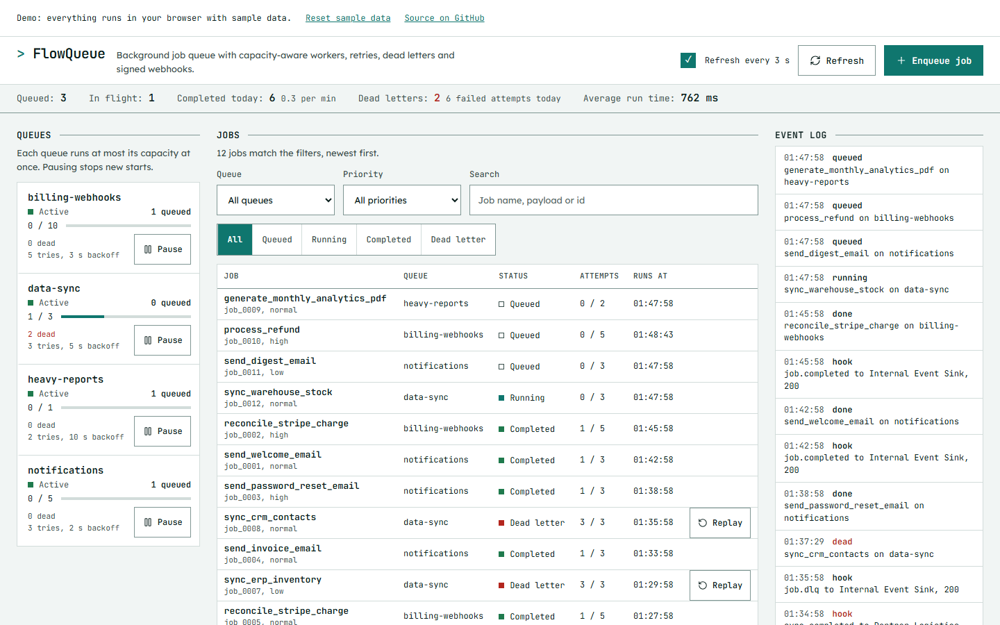

# FlowQueue

FlowQueue is a background job queue with capacity-aware workers, retries with exponential backoff, a dead-letter list with replay, and HMAC-signed webhooks for job events. It runs on one Node process and one SQLite file, and comes with a React dashboard to watch queues, inspect jobs, replay failures and check webhook deliveries.

It is meant for teams that want a small, inspectable queue next to their application database instead of operating a separate broker, and for anyone who wants to read a compact implementation of reservation, lease and retry logic.

[](https://github.com/Taan1el/flowqueue/actions/workflows/ci.yml)
[](https://github.com/Taan1el/flowqueue/actions/workflows/pages.yml)
[](LICENSE)

**Live demo:** https://taan1el.github.io/flowqueue/

The demo runs entirely in your browser. A small in-page engine applies the same queue rules as the server (slot reservation, backoff, dead-lettering, replay and the dashboard metrics come from `shared/queue-logic.ts`) over a fixed set of sample queues, jobs and webhook deliveries. Nothing is sent over the network.

## Screenshot



More screenshots: [the job inspector](docs/screenshots/02-job-inspector.png), [dead letters and webhook deliveries](docs/screenshots/03-dead-letters-webhooks.png), [the dashboard at phone width](docs/screenshots/04-mobile.png).

## Features

- **Queues with capacity.** Each queue has a concurrency limit. A worker reserves only the free slots, so a queue never runs more jobs than its capacity, even with several worker processes on the same database.
- **Priorities and delays.** Jobs are ordered by priority (`high`, `normal`, `low`), then due time, then id. `delay_seconds` schedules a job for later.
- **Retries with backoff.** A failed run is retried after `backoff_base_sec * 2^(n-1)` seconds plus 0 or 1 second of jitter, until the job has used `max_retries` runs.
- **Dead letters and replay.** A job that used all of its runs moves to the dead letters with its error and full attempt history. Replaying it grants exactly one more run.
- **Worker leases.** A reserved job holds a lease. If the worker dies, the next poll returns the job to the queue and counts the lost run as a failed attempt.
- **Idempotency keys.** Enqueueing with a key that already exists returns the existing job instead of creating a second one.
- **Signed webhooks.** `job.completed`, `job.failed` and `job.dlq` are posted to subscribed endpoints with an `X-FlowQueue-Signature` HMAC-SHA256 header. Every delivery is logged with status, duration and signature.
- **Console.** A one-line telemetry bar, vertical queue tabs with depth, in-flight counts against capacity and pause controls, a jobs table with filters and search, a live event log (newest first), tabs under the table for dead letters, webhook deliveries and the enqueue form, and a job inspector with payload, result and attempts. Set in JetBrains Mono and Lexend with square corners and hairline rules.
- **Demo mode** for GitHub Pages that needs no server.

## Getting started

### Prerequisites

Node.js 22.13 or newer (the server uses the built-in `node:sqlite` module, which prints an experimental warning at start-up).

### Install

```bash
git clone https://github.com/Taan1el/flowqueue.git
cd flowqueue
npm install
```

### Run

```bash
npm run dev
```

This starts the API and worker on http://localhost:4000 and the Vite dev server on http://localhost:5173, which proxies `/api` to the server. On first start the database is created at `server/data/flowqueue.db` and filled with four sample queues, a few jobs and two webhook subscriptions.

To run the built version instead, the server serves the dashboard itself:

```bash
npm run build
npm start
```

Then open http://localhost:4000.

### Environment variables

Server (`server/.env.example`; the server reads the process environment, so export the values or use `node --env-file=.env`):

| Variable | Default | Meaning |
|---|---|---|
| `PORT` | `4000` | HTTP port |
| `DB_PATH` | `./data/flowqueue.db` | SQLite file, relative to the working directory |
| `LEASE_SECONDS` | `60` | How long a worker may hold a job before another poll recovers it |
| `WORKER_POLL_MS` | `1000` | Milliseconds between worker polls |
| `WORKER_BATCH_SIZE` | `5` | Most jobs one poll may reserve across all queues |

Client (`client/.env.example`, development only):

| Variable | Default | Meaning |
|---|---|---|
| `VITE_API_TARGET` | `http://localhost:4000` | Where the Vite dev server proxies `/api` |

## Scripts

| Command | What it does |
|---|---|
| `npm run dev` | API with worker and Vite dev server together |
| `npm run dev:server` / `npm run dev:client` | Either one alone |
| `npm run build` | Compiles the server and builds the dashboard |
| `npm run build:pages` | Builds the dashboard in demo mode with the `/flowqueue/` base path |
| `npm start` | Runs the compiled server, which also serves `client/dist` |
| `npm run lint` | Type-checks both workspaces |
| `npm test` | Server and client tests |

## How it works

```
React dashboard  --/api-->  Express routes --> controllers (validation) --> services
                                                                              |
                          worker poll loop (same process) ------------------>  repositories --> SQLite (WAL)
                                                                              |
                                           signed webhook deliveries <--------+
```

1. **Enqueue.** `POST /api/jobs` validates the body, resolves the queue by name, applies the idempotency key and stores the job as `queued` with its `run_at`.
2. **Reserve.** Each worker poll runs `BEGIN IMMEDIATE`, returns expired leases to the queue, then selects due jobs from unpaused queues. Per queue, only `concurrency - processing` jobs are eligible; the eligible jobs of all queues are ordered by priority, due time and id and cut to the batch size. Selected jobs become `processing` with `locked_by` and `locked_until` set, all in one transaction.
3. **Run.** The worker runs a handler for each reserved job. Handlers are looked up by job name in the `handlers` option of `WorkerService`; a job whose name has no handler runs a built-in simulated one (see limitations).
4. **Settle.** Completion or failure and the attempt record are written in one transaction, and only while the job is still `processing`. A late result from a worker that lost its lease is discarded.
5. **Retry or dead-letter.** On failure the job is requeued with backoff, or moved to `dlq` when it has used `max_retries` runs. Webhook events are posted in the background.

The rules that do not touch a database (priority weights, backoff, dead-letter and replay decisions, which jobs a poll may reserve, metrics definitions) live in `shared/queue-logic.ts`. The server tests check them against the SQL implementation, and the demo engine in the browser uses the same functions.

Design records: [ADR-001 queue architecture](docs/adr/ADR-001-relational-task-queue-architecture.md), [ADR-002 backoff and dead letters](docs/adr/ADR-002-exponential-backoff-and-dlq-strategy.md), [ADR-003 webhook signatures](docs/adr/ADR-003-webhook-hmac-signatures-and-delivery-guarantees.md).

### Project layout

```
shared/                 types and queue-logic.ts, used by the server and the browser demo
server/src/
  app.ts                Express app factory, static serving of client/dist
  index.ts              entry point: reads the environment, starts API and worker
  db/                   connection, schema (with column migration), sample data
  repositories/         SQL for queues, jobs, attempts, webhooks
  services/             queue, worker, webhook and metrics logic
  controllers/ routes/  HTTP layer
  lib/                  input validation, errors, repo path lookup
server/test/            API, worker, lease, webhook, shared-logic and static-serving tests
client/src/
  components/           header, telemetry bar, queue tabs, jobs table, event log, enqueue form, dead letters,
                        webhook panel, job inspector, demo banner
  services/             api.ts (real), demoApi.ts (browser), index.ts (chooses by build mode)
  demo/engine.ts        in-browser queue engine for the Pages build
  styles/tokens.css     design tokens
  test/                 component, demo engine and helper tests
```

## API reference

All responses are JSON: `{ "success": true, "data": ... }` or `{ "success": false, "error": "..." }`. Invalid input returns 400, unknown ids 404, a replay of a job that is not dead-lettered 409.

| Method | Path | Description |
|---|---|---|
| `GET` | `/api/health` | Service status and uptime |
| `GET` | `/api/metrics` | Queued, running, completed today, failed attempts today, dead letters, average run time, jobs completed per minute over the last 10 minutes. "Today" starts at 00:00 UTC |
| `GET` | `/api/queues` | Queues with `active_jobs`, `queued_jobs` and `dlq_jobs` |
| `PATCH` | `/api/queues/:id` | Body with any of `is_paused` (boolean), `concurrency` (1 to 100), `max_retries` (1 to 20) |
| `POST` | `/api/jobs` | Enqueue. Body: `queue_name`, `name`, optional `payload` (object), `priority`, `delay_seconds` (0 to 604800), `idempotency_key`, `max_retries` (1 to 20). 201 when created, 200 with `meta.idempotent_duplicate: true` when the key exists |
| `GET` | `/api/jobs` | Query: `queue_id`, `status` (`queued`, `processing`, `completed`, `dlq`), `priority`, `search` (name, payload or id), `limit` (1 to 200, default 50), `offset`. Newest first, `meta.total` counts all matches |
| `GET` | `/api/jobs/:id` | One job with `attempts_list` |
| `POST` | `/api/jobs/:id/retry` | Replay a dead-lettered job with one more run |
| `GET` | `/api/webhooks/subscriptions` | Subscriptions; the secret is masked |
| `POST` | `/api/webhooks/subscriptions` | Body: `name`, `url` (http or https), `secret`, `events` (non-empty list) |
| `GET` | `/api/webhooks/deliveries` | The 50 most recent deliveries |
| `POST` | `/api/webhooks/test` | Send one signed delivery now. Body: `subscription_id`, optional `event`, `payload` |
| `POST` | `/api/webhooks/test-receiver` | Sample endpoint that echoes the event and signature it receives; it does not verify them |

Webhook requests are `POST` with a JSON body `{ id, event, created_at, data }` and the headers `X-FlowQueue-Event`, `X-FlowQueue-Delivery` and `X-FlowQueue-Signature: sha256=<hex>`. The signature is the HMAC-SHA256 of the raw body keyed with the subscription secret. A receiver checks it like this:

```js
const expected = 'sha256=' + crypto.createHmac('sha256', secret).update(rawBody).digest('hex');
const ok = expected.length === received.length &&
  crypto.timingSafeEqual(Buffer.from(expected), Buffer.from(received));
```

## Testing

```bash
npm test
```

161 tests: 94 on the server (Vitest and Supertest, in-memory SQLite) and 67 in the client (Vitest, React Testing Library). The server tests cover routes and input validation, ordering and capacity, backoff, dead-lettering and replay, leases, signatures and delivery, and check the shared rules against the SQL queries. The client tests cover the main flows (filters, enqueueing, pausing, replay, the inspector, webhook tests, polling) and run the whole app against the demo engine. Tests use fake clocks and injected fetch and timers; none of them sleep.

The client suite includes automated accessibility checks (axe, WCAG 2 A and AA rules) for the queue tabs, the jobs table, the dead letters, webhooks and enqueue tabs, the event log and the job inspector. jsdom cannot compute colors, so color contrast is checked outside it, from computed values in a real browser.

CI runs lint, tests, `build` and `build:pages` on Node 22 and 24, then builds the Docker image and checks that the container answers `/api/health` and serves the dashboard.

## Deployment

### Docker

```bash
docker compose up --build
```

The image builds the server and the dashboard, runs as the unprivileged `node` user, and serves both on http://localhost:4000. The SQLite file is `/app/data/flowqueue.db` on the `flowqueue-data` volume. The Dockerfile was written against the build output layout (`server/dist/server/src/index.js`); the CI docker job starts the image and requests both the API and the dashboard.

### GitHub Pages

`.github/workflows/pages.yml` builds `npm run build:pages` and deploys `client/dist` once the repository is public (the deploy job is skipped while it is private). The build uses base path `/flowqueue/` and demo mode; run `npx vite preview --mode pages` from `client/` to check it locally.

## Design notes and limitations

- **No authentication.** Anyone who can reach the API can enqueue, pause queues, replay jobs and read payloads. Webhook secrets are never returned, but subscription URLs are only checked for http or https, so the server will post to any address it can reach, including internal ones. Keep it on a private network or behind your own gateway.
- **Handlers are simulated unless you register real ones.** The built-in handler waits 150 ms and returns a made-up result chosen from the job name (`email`, `invoice`/`charge`, `report`); it fails on purpose when the payload has `should_fail: true` or `simulate_error: true`. Real handlers are registered in code through the `handlers` option of `WorkerService`; there is no plugin loading and no way to configure handlers over the API.
- **`max_retries` counts runs.** A job with `max_retries: 3` runs at most three times.
- **Webhooks are sent once.** A failed delivery is logged (status 504 for network errors and 6 s timeouts) and not retried. Replays of a captured request are possible because the signature has no timestamp.
- **Leases have no heartbeat.** A handler that runs longer than `LEASE_SECONDS` can be started again elsewhere, and its late result is discarded. Lease recovery does not send webhook events. Jobs that were `processing` before the lock columns existed are not recovered automatically.
- **One SQLite file.** Several processes can share the file on one host (the capacity tests cover two connections), but not over a network file system. Every state change is a disk write; throughput has not been measured.
- **Queues come from the sample data.** There is no endpoint or screen to create or delete queues, and subscriptions can only be added through the API.
- **Idempotency keys are global and permanent.** A repeated key returns the first job even if the payload differs, across all queues.
- **The dashboard polls every 3 seconds** and shows the newest 50 jobs that match the filters.
- **`node:sqlite` is experimental** in Node 22 and 24 and prints a warning.
- **Demo mode** simulates the worker in the page. Webhook deliveries are generated locally with real HMAC-SHA256 signatures, but no request leaves the browser.

## Roadmap

- Retry webhook deliveries with backoff and a delivery id receivers can deduplicate on.
- Lease heartbeats so long handlers can extend their lease.
- API key for write requests.
- Create and delete queues, and add subscriptions, from the dashboard.
- Recurring (cron-style) jobs.
- Measure and publish throughput numbers for a typical single-host setup.

## License

MIT, see [LICENSE](LICENSE).
